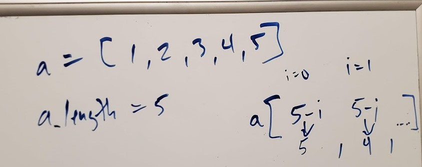

# Table of Contents

## Reverse an Array
Write a function called reverseArray which takes an array as an argument.

## Challenge Description
Without utilizing any of the built-in methods available to your language, return an array with elements in reversed order.

## Approach & Efficiency
My thought was to focus first on the length of the array given it could vary. Next was to take that length to dynamically change how many time I needed to loop through that array. Lastly I used the difference of the length of the array and an incrementer starting at 1 to return results from the last index starting first.

## Solution

## Shift Array
Write a function called insertShiftArray which takes in an array and the value to be added. 

## Challenge Description
Without utilizing any of the built-in methods available to your language, return an array with the new value added at the middle index.

## Approach & Efficiency
My thought was to focus first on the length of the array given it could vary. Next was to take that length and divide in half to find the index to insert the second argument. Next was to loop through the array at each index and if the index was less than half of the array, keep the integer the same. If equal to the middle, append the new integer into this position. Any index greater than the middle index, would be added 1 index position

## Solution

# Binary Search
Write a function called BinarySearch which takes in 2 parameters: a sorted array and the search key.

## Challenge Description
 Without utilizing any of the built-in methods available to your language, return the index of the array’s element that is equal to the search key, or -1 if the element does not exist.

## Approach & Efficiency
My thought was to focus first on the length of the array given it could vary. Next was to take that length and divide in half to find the index to determine if the value was equal, less than or greater than the middle. Next would continue this logic redefining the lowest the upper integers, comparing to the middle integer.

## Solution

# Matrix Array
write a function to add up the sum of each row in a matrix of arbitrary size, and return an array with the appropriate values.

## Challenge Description
Avoid utilizing any of the built-in methods available to your language.
The matrix will always be full of integers.
Negative values are possible.
All nulls will be counted as zeros.

## Approach & Efficiency
My thought was to focus first on the length of the array given it could vary. Next was to id the length of the array at index 0,1,2,... and then loop through the integers within each of those arrays, accumulating the values into an output.

## Solution
