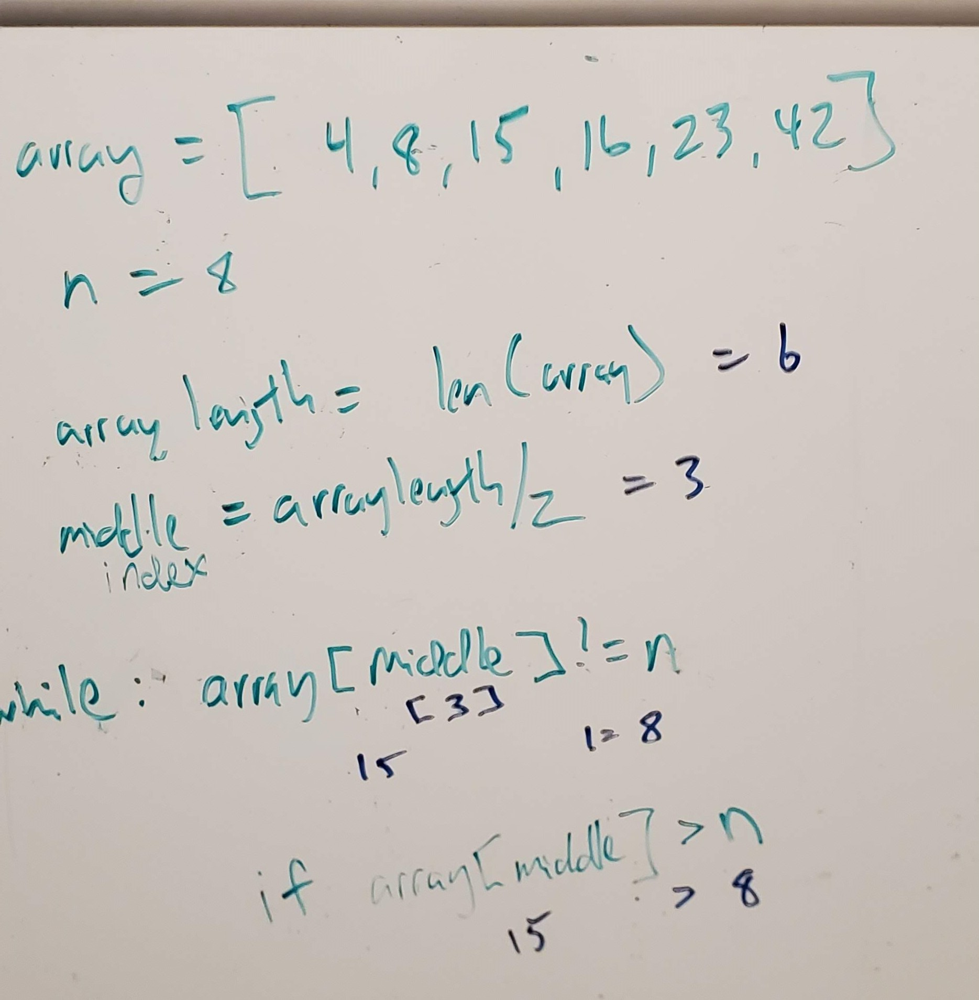

# Binary Search
Write a function called BinarySearch which takes in 2 parameters: a sorted array and the search key.

### Challenge Description
 Without utilizing any of the built-in methods available to your language, return the index of the array’s element that is equal to the search key, or -1 if the element does not exist.

### Approach & Efficiency
My thought was to focus first on the length of the array given it could vary. Next was to take that length and divide in half to find the index to determine if the value was equal, less than or greater than the middle. Next would continue this logic redefining the lowest the upper integers, comparing to the middle integer.

### Solution
