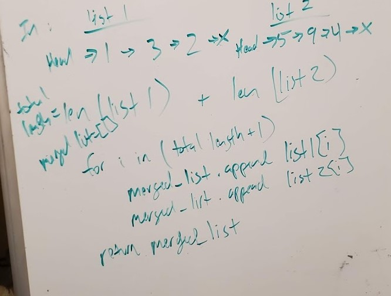

## Linked List Merge
Write a function called mergeLists which takes two linked lists as arguments. Zip the two linked lists together into one so that the nodes alternate between the two lists and return a reference to the head of the zipped list.

## Challenge Description
Try and keep additional space down to O(1). You have access to the Node class and all the properties on the Linked List class as well as the methods created in previous challenges.

## Approach & Efficiency

My thought was to focus first on the length of both lists and accumulate a total. Then I could loop through the entire length and append each list at the corresponding index of i and append to a final merged list.

## Solution

