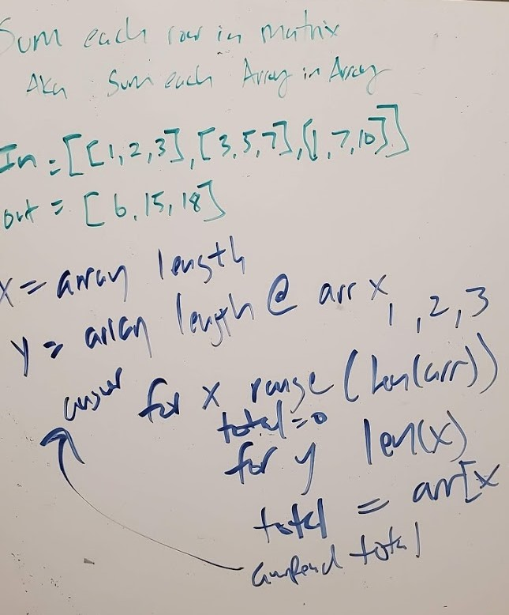

# Matrix Array
write a function to add up the sum of each row in a matrix of arbitrary size, and return an array with the appropriate values.

## Challenge Description
Avoid utilizing any of the built-in methods available to your language.
The matrix will always be full of integers.
Negative values are possible.
All nulls will be counted as zeros.

## Approach & Efficiency
My thought was to focus first on the length of the array given it could vary. Next was to id the length of the array at index 0,1,2,... and then loop through the integers within each of those arrays, accumulating the values into an output.

## Solution
