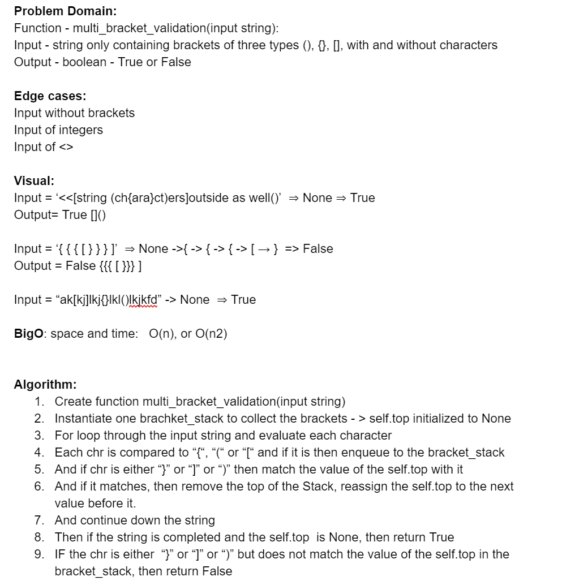

## Multi Bracket Validation
Your function should take a string as its only argument, and should return a boolean representing whether or not the brackets in the string are balanced.
## Challenge Description
There are 3 types of brackets:

Round Brackets : ()
Square Brackets : []
Curly Brackets : {}

## Approach & Efficiency
Vig and I collaborated on the approach to this challenge, attached is the shared whiteboad document we created, but our code was independently created.

Efficiency is O(n^2) given the loops to iterate through the input.

## Solution

