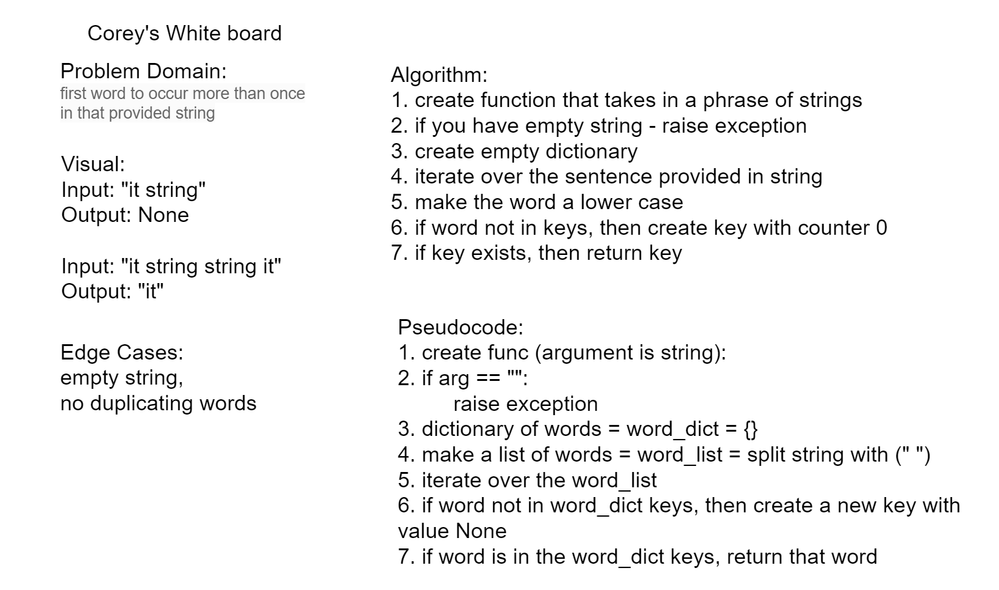

# Repeated Word
Write a function that accepts a lengthy string parameter.

## Challenge Description
Without utilizing any of the built-in library methods available to your language, return the first word to occur more than once in that provided string.

## Approach & Efficiency
O(n) given the single loop

## Solution

