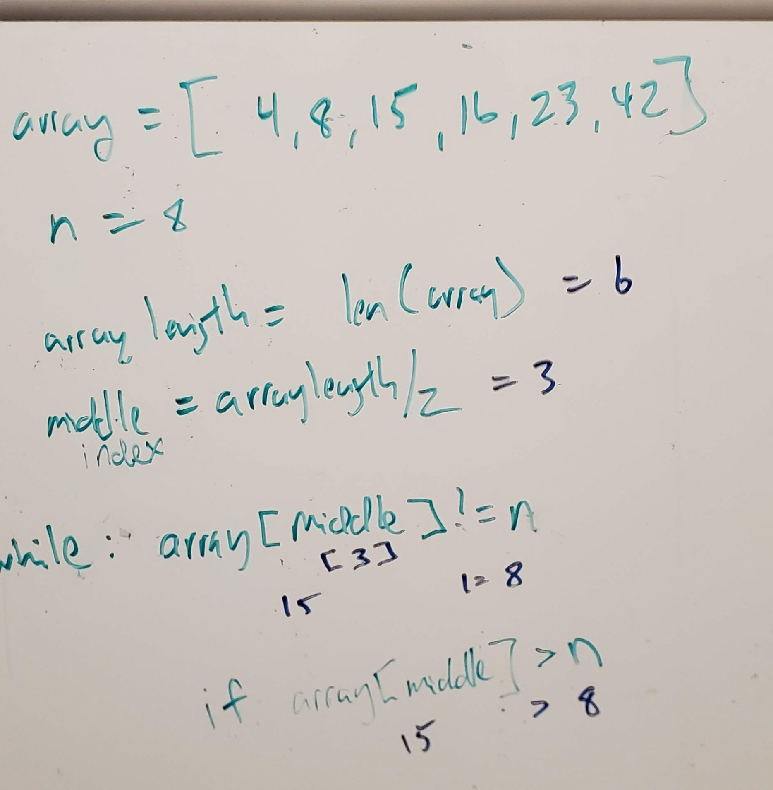

# Stack and Queue
 - Create a Node class that has properties for the value stored in the Node, and a pointer to the next node.
 - Create a Stack class that has a top property. It creates an empty Stack when instantiated.
 - Create a Queue class that has a front property. It creates an empty Queue when instantiated.

### Challenge Description
This object should be aware of a default empty value assigned to top when the stack is created.
Define a method called push which takes any value as an argument and adds a new node with that value to the top of the stack with an O(1) Time performance.
Define a method called pop that does not take any argument, removes the node from the top of the stack, and returns the node’s value.
Should raise exception when called on empty stack
Define a method called peek that does not take an argument and returns the value of the node located on top of the stack, without removing it from the stack.
Should raise exception when called on empty stack
Define a method called isEmpty that takes no argument, and returns a boolean indicating whether or not the stack is empty.

<!-- ### Approach & Efficiency
My thought was to focus first on the length of the array given it could vary. Next was to take that length and divide in half to find the index to determine if the value was equal, less than or greater than the middle. Next would continue this logic redefining the lowest the upper integers, comparing to the middle integer.

### Solution
 -->
